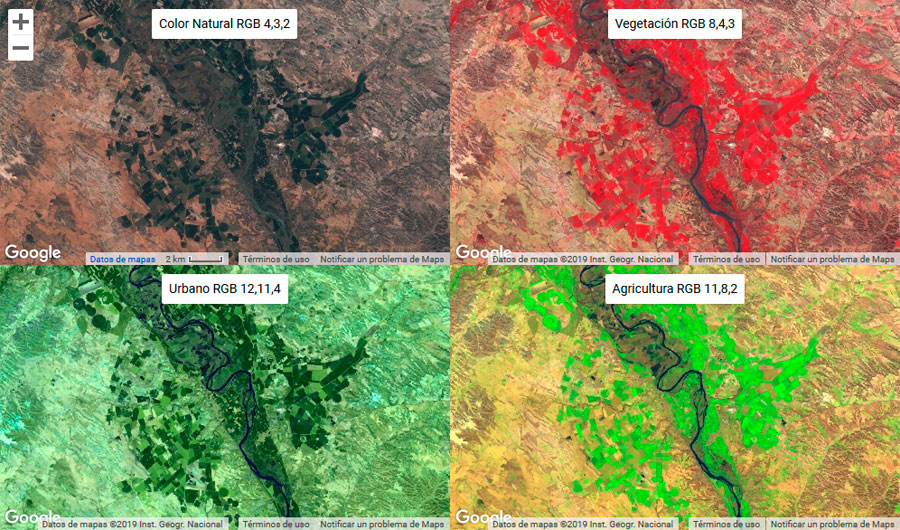

# Fragmentación y conectividad boscosa de los paisajes cafetaleros en la Zona de los Santos

## Descripción general del proyecto 
Las actividades humanas han acelerado la transformación de los paisajes naturales, reduciendo la extensión y la condición de la vegetación nativa mediante procesos como la expansión agrícola y el crecimiento urbano (Didham, 2010; Fletcher et al., 2018; Mi et al., 2019). Estos cambios de cobertura y uso de la tierra alteran la dinámica del paisaje y generan impactos ecológicos, económicos y culturales (Lambin & Meyfroidt, 2011; Dupuy et al., 2012).

Este proyecto se centra en la Zona de los Santos, un territorio montañoso del sur de la provincia de San José, Costa Rica, conformado por los cantones de Tarrazú, Dota y León Cortés Castro, donde la caficultura ha sido históricamente el motor productivo principal. Entre 1990 y 2010, el fortalecimiento del modelo cooperativo —en especial de Coopetarrazú R.L.— impulsó la expansión de los cultivos de café y transformó la configuración del paisaje (Salazar Arguedas, 2022); para el periodo 2022–2023, esta zona representó un 26,5 % de la producción cafetalera nacional (ICAFE, 2023).

Estudios previos documentan, entre 1984 y 2014, una expansión sostenida de la caficultura y un aumento de la cobertura forestal total, particularmente en el cantón de Dota, pero también advierten un mayor aislamiento de los remanentes boscosos como consecuencia del avance del monocultivo cafetalero, especialmente en zonas bajas de mayor aptitud agrícola (Arias Salazar & Corrales León, 2017; Consejo Territorial de Desarrollo Rural Los Santos, 2016).

  

Actualmente se a trabajo este tema de monitoreo utilizando herramientas de Sistema de información Geografíca y teledetección. Vancutsem et al. (2021), por ejemplo, generaron un mapeo continuo (wall-to-wall) de los cambios en la cobertura de los bosques tropicales húmedos entre enero de 1990 y diciembre de 2019, utilizando imágenes Landsat con una resolución espacial de 30 x 30 m (0.09 ha por píxel). De manera similar, pero con imágenes de mayor resolución espacial, Xia et al. (2020) utilizaron imágenes QuickBird con un tamaño de celda de 2.44 m, correspondientes a cuatro fechas entre 2006 y 2015, para obtener datos de uso del suelo del área de estudio mediante clasificación orientada a objetos en el software eCognition Developer 8.7, el cual agrupa píxeles con características espectrales, de textura y forma similares en unidades homogéneas antes de clasificarlas, lo que resulta especialmente útil para imágenes de alta resolución donde la clasificación píxel por píxel tiende a generar mayor margen de error.

### Descripción de los datos y principales variables.
Con base en metodologías utilizadas en el monitoreo de cambios en el paisaje, el análisis se apoya en información geoespacial de acceso público y en registros institucionales sobre producción cafetalera. Dentro de las consideraciones para lograr un resultado más preciso, se necesita trabajar con datos de mayor resolución espacial; en este caso, imágenes Sentinel-2 con bandas de 10 m de resolución. Sin embargo, estos datos están disponibles a partir de mediados de 2015, por lo que esta investigación se realizará en dos periodos: de 2015 a 2019 y de 2020 a 2025.

* **Imágenes satelitales Landsat y Sentinel-2**, utilizadas para clasificar la cobertura y el uso de la tierra en los períodos de estudio. Disponibles a través del visor [USGS EarthExplorer](https://earthexplorer.usgs.gov/) y de [Copernicus Data Space Ecosystem](https://dataspace.copernicus.eu/).
* **Capas de cobertura y uso de la tierra de Costa Rica**, elaboradas por instituciones nacionales como el Sistema Nacional de Áreas de Conservación (SINAC) y el Ministerio de Ambiente y Energía (MINAE), útiles para contrastar y validar las clasificaciones obtenidas.
* **Datos del [Tropical Moist Forest Explorer](https://forobs.jrc.ec.europa.eu/TMF/explorer):** Este conjunto de datos aporta mapas de cobertura boscosa tropical húmeda a 30 m de resolución, útiles para identificar y caracterizar procesos de *deforestación* (pérdida de bosque) y *degradación* (perturbaciones temporales como tala selectiva o eventos climáticos extremos) en los remanentes boscosos en la Zona de los Santos, así como su posible recuperación o regeneración a lo largo del periodo de estudio.
* **Capas de división administrativa cantonal**, obtenidas del [Sistema Nacional de Información Territorial (SNIT)](https://www.snitcr.go.cr/), utilizadas para delimitar los cantones de Tarrazú, Dota y León Cortés Castro que conforman la Zona de los Santos, y como base cartográfica de referencia para acotar el área de estudio.

##  Soluciones o preguntas que se espera contestar con los datos.

¿Cuales son los tipos de coberturas y usos del suelo predominantes en la Zona de los Santos?

¿Cual es la delimitación especifica para el area de estudio?

Cuantificar los tipos de coberturas y usos del suelo, obteniendo datos mas exactos de sus extensiones.

